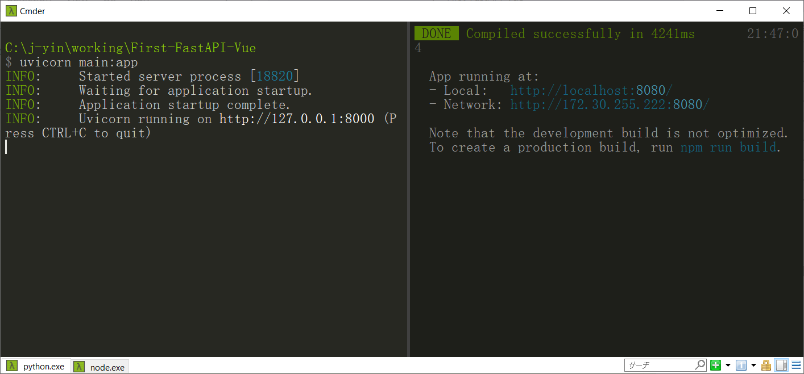
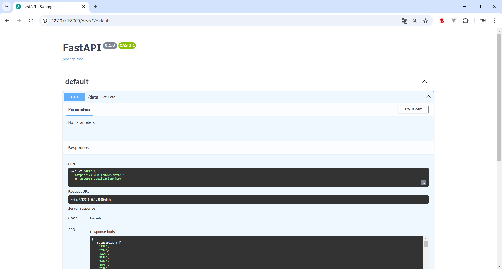
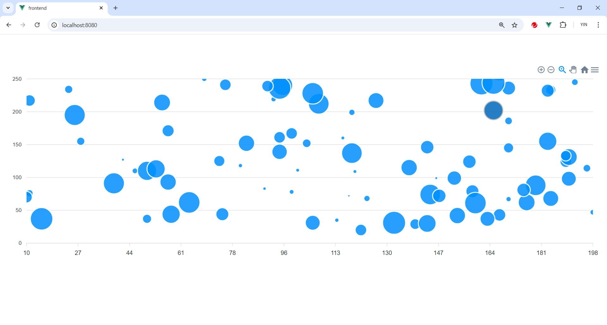

# First-FastAPI-Vue
参考：
 [FastAPIで作成したデータをVue.jsで表示させる https://qiita.com/Qiita/items/c686397e4a0f4f11683d](https://qiita.com/inoshun/items/75260e3543e9fb96f614)

## Backend
### Install FastAPI
```bash
pip install FastAPI uvicorn
```

### Example
```python
from fastapi import FastAPI
from fastapi.middleware.cors import CORSMiddleware
import random
import string

app = FastAPI()

# CORSの設定
app.add_middleware(
    CORSMiddleware,
    allow_origins=["http://localhost:8080"],
    allow_credentials=True,
    allow_methods=["*"],
    allow_headers=["*"],
)

def generate_random_string(length):
    letters = string.ascii_uppercase
    return ''.join(random.choice(letters) for _ in range(length))

@app.get("/data")
def get_data():
    categories = [generate_random_string(3) for _ in range(100)]
    values = []
    for _ in range(100):
        x = random.randint(10, 200)
        y = random.randint(20, 300)
        z = random.randint(5, 50)
        values.append({"x": x, "y": y, "z": z})
    data = {
        "categories": categories,
        "values": values
    }
    return data

if __name__ == "__main__":
    import uvicorn
    uvicorn.run(app, host="0.0.0.0", port=8080)

```

実行する
> python main.py

あるいは、

> uvicorn main:app
> uvicorn main:app --reload


In browser, confirm by accessing
[http://127.0.0.1:8080](http://127.0.0.1:8000) 
[http://127.0.0.1:8080/docs](http://127.0.0.1:8000/docs)
[http://127.0.0.1:8000/redoc](http://127.0.0.1:8000/redoc)

### Try it out


## Frontend
### Install node.js
[Download Node.js®](https://nodejs.org/en/download/prebuilt-installer)
```bash
$ node --version
v20.18.0
$ npm --version
9.5.1
```
### Install vue/cli
> npm install -g @vue/cli
```bash
$ vue --version
@vue/cli 5.0.8

$ npm install --save apexcharts vue3-apexcharts   #optional
```

### Create frontend

```bash
$ vue create frontend
$ cd frontend
$ dir                                                
 ドライブ C のボリューム ラベルは OS です                            
 ボリューム シリアル番号は 8085-675C です                          
                                                     
 C:\j-yin\working\First-FastAPI-Vue\frontend のディレクトリ 
                                                     
2024/10/08  21:27    <DIR>          .                
2024/10/08  21:27    <DIR>          ..               
2024/10/08  21:27               231 .gitignore       
2024/10/08  21:27                73 babel.config.js  
2024/10/08  21:27               279 jsconfig.json    
2024/10/08  21:27    <DIR>          node_modules     
2024/10/08  21:27           443,763 package-lock.json
2024/10/08  21:27               884 package.json     
2024/10/08  21:27    <DIR>          public           
2024/10/08  21:27               320 README.md        
2024/10/08  21:27    <DIR>          src              
2024/10/08  21:27               118 vue.config.js    
               7 個のファイル             445,668 バイト      
               5 個のディレクトリ  118,820,499,456 バイトの空き領域  
```

```shell
npm run serve

```

### Confirm
Access [ http://localhost:8080/](http://localhost:8080/)


### Modify 
#### `App.vue`
```js
<template>
  <div id="app">
    <DataChart />
  </div>
</template>

<script>
import DataChart from './components/DataChart.vue';

export default {
  name: 'App',
  components: {
    DataChart,
  },
};
</script>

<style>
#app {
  font-family: Avenir, Helvetica, Arial, sans-serif;
  -webkit-font-smoothing: antialiased;
  -moz-osx-font-smoothing: grayscale;
  text-align: center;
  color: #2c3e50;
  margin-top: 60px;
}
</style>

```

### create `components/DataChart.vue`
```js
<template>
  <div id="chart">
    <apexchart type="bubble" height="400" :options="chartOptions" :series="series"></apexchart>
  </div>
</template>

<script>
import apexchart from 'vue3-apexcharts';

export default {
  name: 'DataChart',
  components: {
    apexchart,
  },
  data() {
    return {
      chartOptions: {
        chart: {
          id: 'my-chart',
          type: 'bubble',
          height: 400,
        },
        xaxis: {
          tickAmount: 10,
          labels: {
            formatter: function(value) {
              return value.toFixed(0);
            },
            rotate: -45,
          },
        },
        yaxis: {
          max: 250,
          labels: {
            formatter: function(value) {
              return value.toFixed(0);
            },
          },
        },
        dataLabels: {
          enabled: false,
        },
      },
      series: [],
    };
  },
  async mounted() {
    try {
      const response = await fetch('http://localhost:8000/data');
      const data = await response.json();
      console.log('Fetched data:', data);
      this.series = [{
        name: 'Bubble Chart',
        data: data.values.map((value, index) => ({
          x: value.x,
          y: value.y,
          z: value.z,
          name: data.categories[index],
        })),
      }];
      console.log('Chart data:', this.series);
    } catch (error) {
      console.error('Error fetching data:', error);
    }
  },
};
</script>

```





